# IBM FAU Hackathon
This is an IoT project named LightUp aiming to introduce to FAU Hackathon event an example as for how to build an IoT application using.
The resulting application is a small mobile web page that allows the user to turn-on and turn-off an electronic device from anywhere using his smartphone.
Here is the architecture overview of the application:

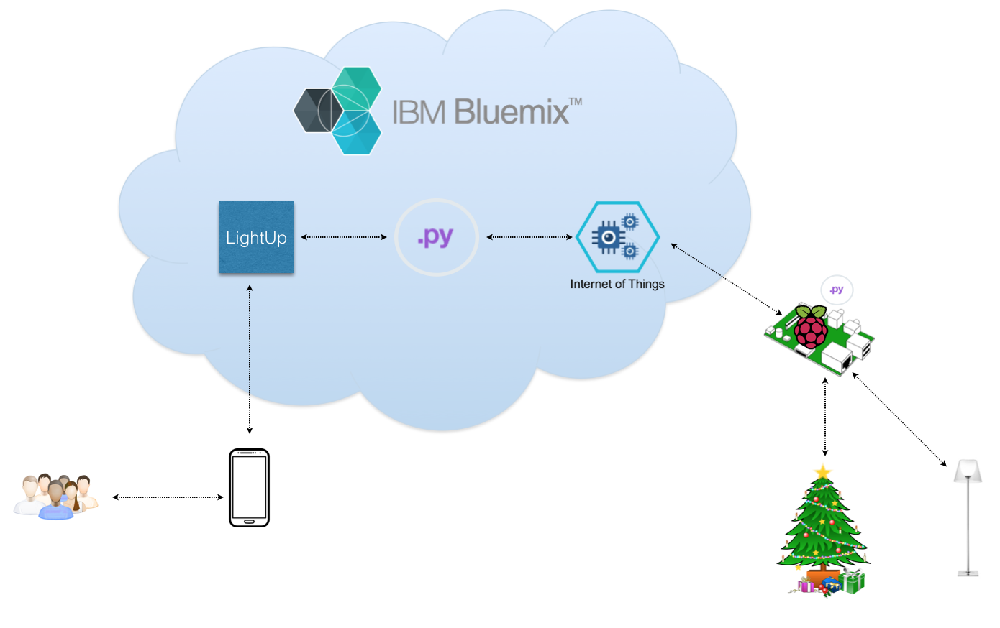

# Stuffs needed for building project
## Hardware:

1. Raspberry Pi (I'm using 2B and Zero)
2. USB wifi dongle
3. USB keyboard and mouse.
4. HDMI monitor and cable.
5. Micro USB power adapter (smartphone charger).
6. PIR motion sensor.
7. Male-female and male-male jumpers.
8. Breadboard.
9. BC547 transistor.
10. Songle SRD-05VDC-SL-C relay and 1n4001 diode.
11. LED and 220Ohm resistor.

## Software:
1. Raspbian OS
2. Python
3. CloudFoundry cli, Bluemix account (It's free, go to http://bluemix.net/ to register)

## Circuit wiring up:

Below is the pictures that illustrate how to connect the parts together on the breadboard and with the Pi. Make sure you wire things up before jumping to next steps.

All things together:

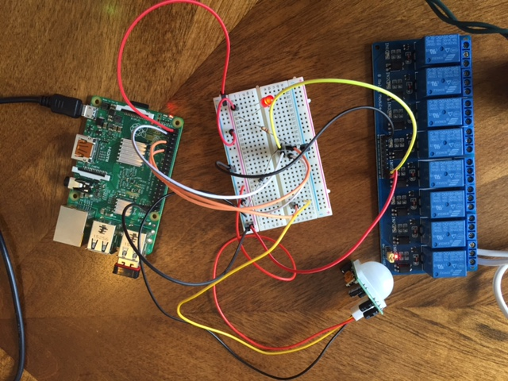

Close look at Raspberry pi part:

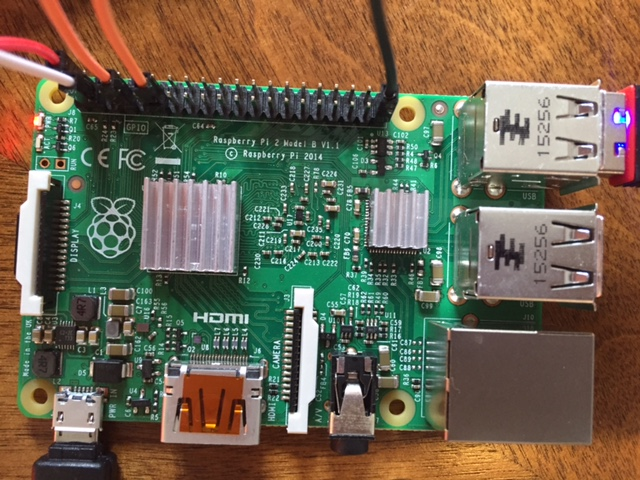

Close look at breadboard part:

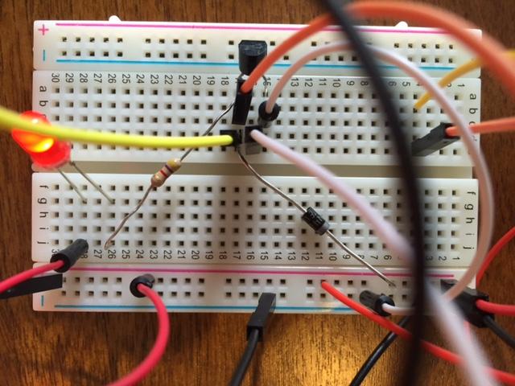

Close look at relay part (I'm using 8 channels relay module and channel 8 is for controlling the appliance). You can connect any device to the power outlet strip to try, eg: a lamp, fan, etc. Remember, this power outlet is connected to your wall with high voltage so be careful.

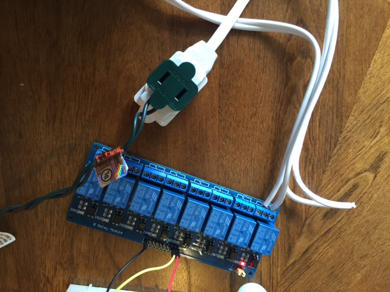

## Basic steps to setup the environment:

###Setup your Rapberry pi

Follow this quick instruction to quickly install your Pi:

https://www.youtube.com/watch?v=PPvIBH7M32Y

You need a monitor and a keyboard for the first time installation. Make sure you use the wifi dongle provided to connect your Pi to Internet through a wifi access point.

Once you have your Pi setup, you can either use the separate keyboard and monitor to interact with you Pi, or through another machine, like your laptop which is a common way developers use.

If you have a laptop with a lot of tools you're comfortable with, just make sure your Pi and your laptop can connect together(eg: on same network) then you know your Pi ip address and can access and work with your Pi using your laptop through ssh or VNC viewer.

### Register your Pi to Bluemix

Assuming you have your Pi setup with internet connection using the wifi dongle in step 1.

Follow these steps to register your Raspberry Pi to Bluemix:

Again, make sure you have a Bluemix account (http://bluemix.net/)
Login to Bluemix using your account credentials
Go to Catalog, type "Internet of things" in the Search bar to search for the IBM Internet of Things Foundation service

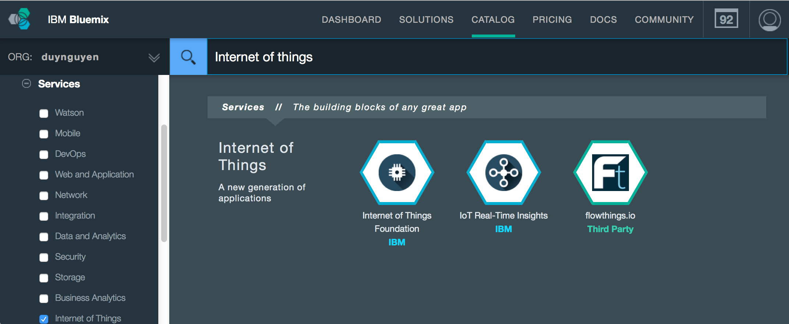

And create one. Make sure you name it correctly so that the example code can work.

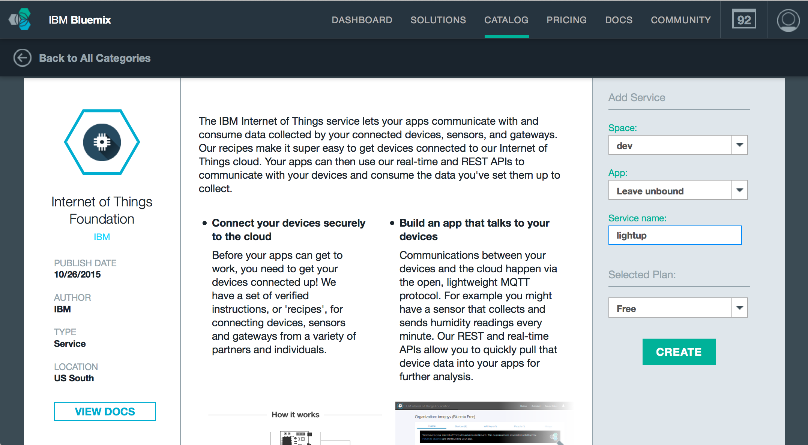

After creating the service, click on Launch dashboard button

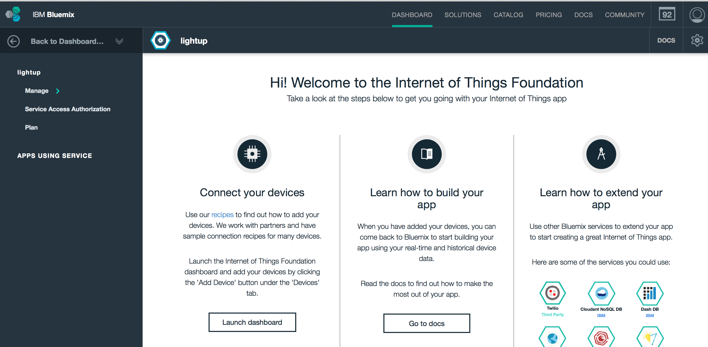

to launch the Dashboard screen.

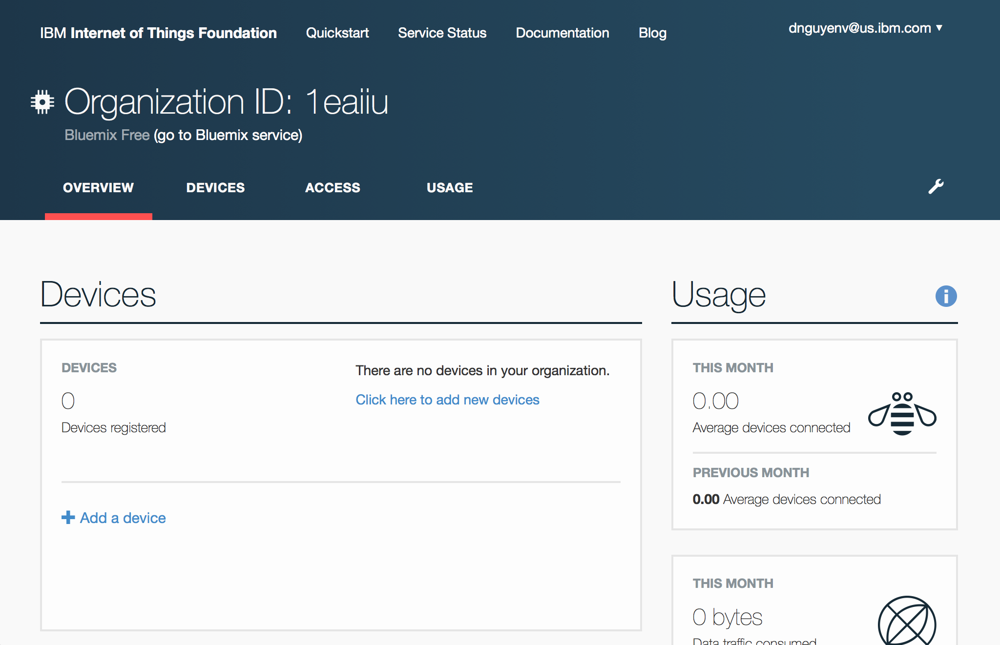

From the dashboard, click on Add a device to add your Raspberry Pi as a new device to the iotf. You need to specify a device type for your device. If you does not have one, create new type, lets name it "RaspberryPi".

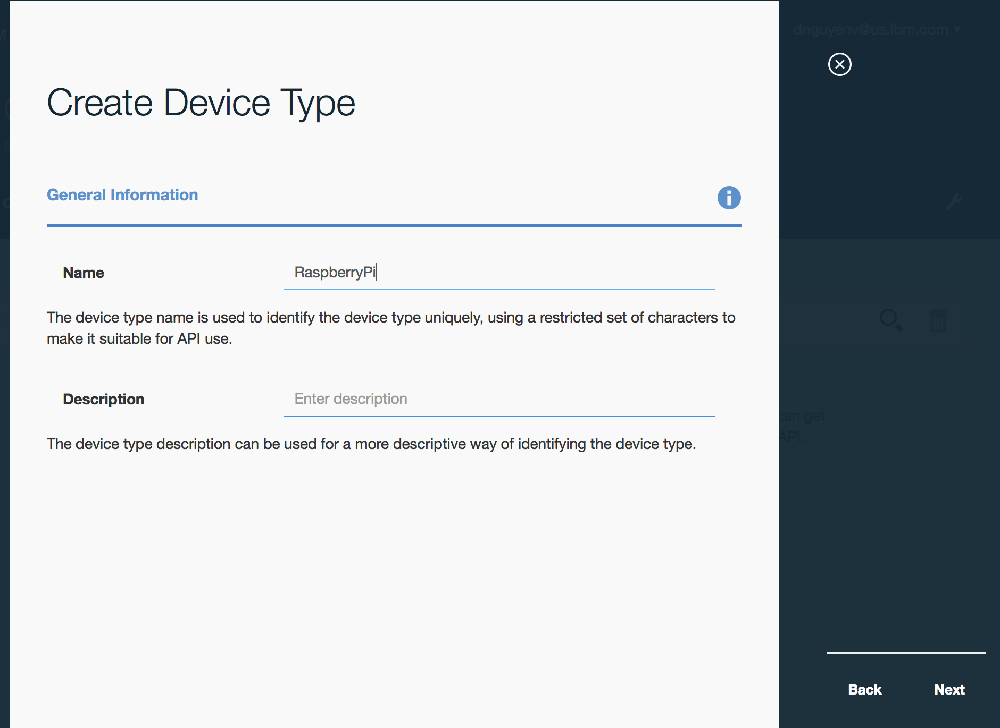

Keep selecting "Next" till the creation done. and map your device to that type. Determine an ID for your Pi. You can use its MAC address or name it as your convenience, as long as it's unique within your Bluemix organization.

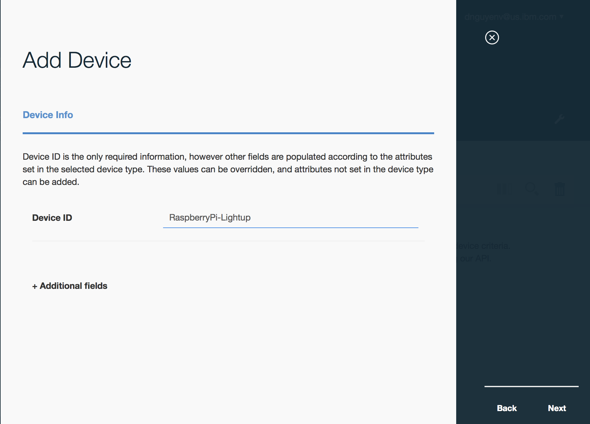

Keep selecting "Next" till the last screen, where you need to record the important information shown on the screen for later use.

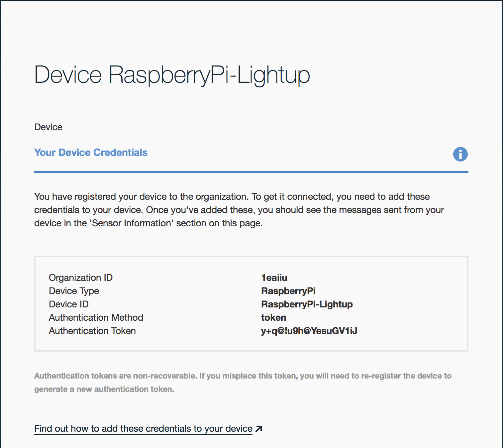

Close the screen, and now your device is added to the list

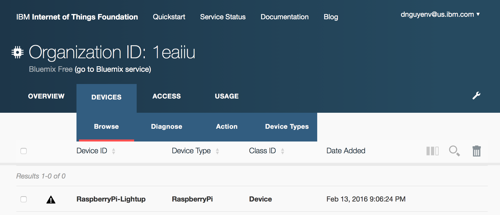

Next step is to generate an access token for accessing the service, to send and receive information to/from the device. Click on the Access link, then API Keys link and Generate API Key button


Remember to record the authentication token displayed for later use since it is one-time shown. You can quickly generate a new one to use as needed.

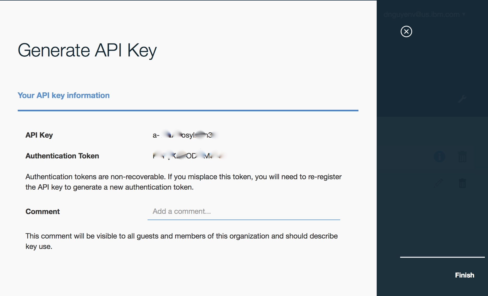


### Run your client code

Assuming you've wired things up following the pictures provided. Login to your Raspberry Pi, then do the following steps to run client component of the project:

Create a directory for the project, lets name it /opt/fau/iotf

```
sudo mkdir -p /opt/fau/iotf
```
Git has been installed by default with the Raspbian so just use it to clone the code to your Pi:

```
cd /opt/fau/iotf
sudo git clone https://github.com/dnguyenv/iot.git
cd iot
```
Modify your the client.py to match your setting, then save it:

```
######################################################
#Update this section to match your environment setting
######################################################
organization = ""
deviceType = ""
deviceId = ""
authMethod = ""
authToken = ""
```

Install ibmiotf and other necessary libraries for Python on your Raspberry Pi:

```
sudo pip install ibmiotf
```

Now run the app:

```
sudo python client.py
```
If it's successfully started, you could see something similar to this:

```
2016-02-13 22:51:50,150   ibmiotf.device.Client      INFO    Connected successfully: d:1eaiiu:RaspberryPi:RaspberryPi-Lightup
```

Now your Client side is connected to IBM IOTF on Bluemix and waiting for commands from Server side component.

### Deploy your server code to Bluemix

You must have a Bluemix account already. We will use command line interface (CLI) to deploy our application (Server component) to Bluemix.

You may want to know how to make CloudFoundry(CF) cli work on your environment here:

https://www.ng.bluemix.net/docs/starters/install_cli.html

Once you have CF CLI installed on your development environment (not necessarily is your Raspberry Pi but can be another laptop with internet connection and Git installed)

Make a directory on your machine, and clone the example code. If you're using Mac, here are some example commands:

```
mkdir -p /opt/fau/iotf
cd /opt/fau/iotf
git clone https://github.com/dnguyenv/iot.git
cd iot
```
Open the server.py file and modify this part to match your setting

Note: You can create Bluemix environment variables and retrieve the values from there too, but lets make it simple by hard-coding them here.

```
#####################################
#Change this setting based on your specific setup
#####################################
organization = ""
deviceType = ""
deviceId = ""
```

Modify manifest.yml to match your Internet of Things Foundation service setting you did before. Also, remember to change the application name to be something unique. The application name will be used to access your application later. For example in this case, the URL to your application on the Internet by default will be:

http://fau-lightup.mybluemix.net

```
applications:
- name: fau-lightup
  memory: 128M
  services:
   - lightup
```
Make sure you're in the directory where the manifest.yml is located, login to Bluemix using your Bluemix ID credentials and do a push to Bluemix using CF CLI

```
cf login -a https://api.ng.bluemix.net
API endpoint: https://api.ng.bluemix.net
Email> dnguyenv@us.ibm.com
Password>
Authenticating...
OK
Targeted org duynguyen

Select a space (or press enter to skip):
1. dev
2. stage

Space> 1
Targeted space dev

API endpoint:   https://api.ng.bluemix.net (API version: 2.40.0)   
User:           dnguyenv@us.ibm.com   
Org:            duynguyen   
Space:          dev

cf push
```

Wait for a minute and if your application deployed successfully, you then see something similar to this indicating the application is running:

```
App fau-lightup was started using this command `python server.py`

Showing health and status for app fau-lightup in org duynguyen / space dev as dnguyenv@us.ibm.com...
OK

requested state: started
instances: 1/1
usage: 128M x 1 instances
urls: fau-lightup.mybluemix.net
last uploaded: Sun Feb 14 05:21:59 UTC 2016
stack: cflinuxfs2
buildpack: python 1.5.1
```

### Try it out

Use your smartphone which has internet connection, to access to

http://fau-lightup.mybluemix.net

You now can send commands from your phone to turn on/off any device connected to the client side of the system.

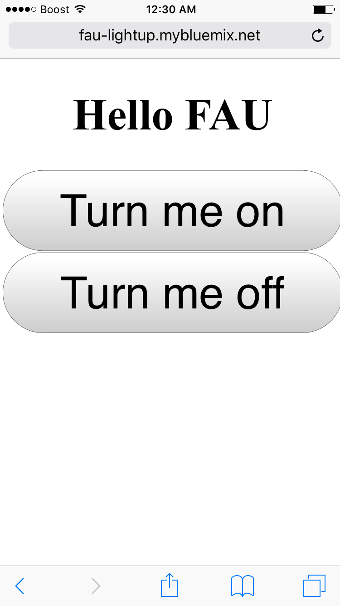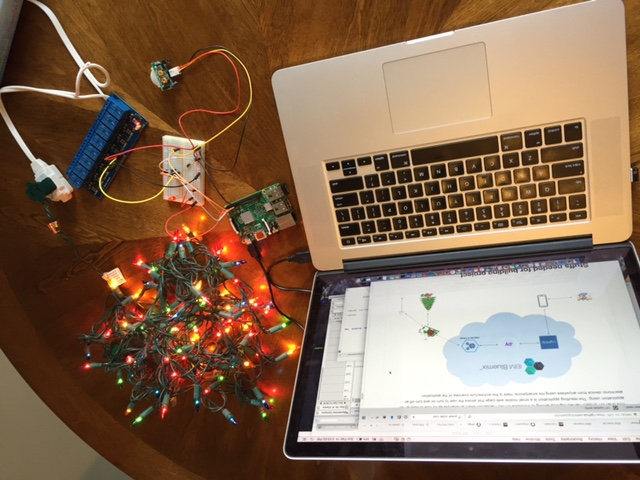

More instructions about how to work with Python iotf library can be found here:
https://docs.internetofthings.ibmcloud.com/libraries/python.html
